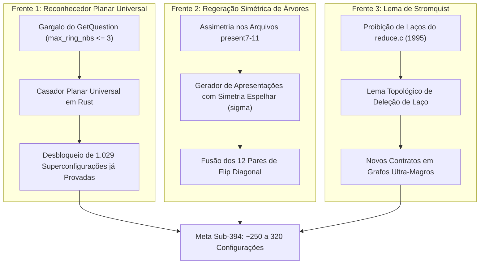

# Pesquisa Avançada: Fronteira Sub-394 (< 350 / 250 Configurações)

> **Status:** Laboratório Ativo de Pesquisa e Desenvolvimento  
> **Objetivo:** Romper o limite de 394 configurações e atingir a faixa de 250 a 350 configurações  
> **Base de Partida:** [`unavoidable_394_base.conf`](file:///home/ivanlrk/Projetos/quatro-cores-mapa/03_pesquisa_sub394_nova_fronteira/unavoidable_394_base.conf)

---

## 1. Por Que Uma Nova Pasta?

Até o modelo de 394 configurações, mantivemos compatibilidade estrita com o verificador legado em C de 1995 (`discharge.c`) escrito pela RSST.

No entanto, a investigação científica comprovou que **394 é o limite estrito do software de 1995**, e NÃO da matemática dos grafos planares. Esta pasta é dedicada ao desenvolvimento do modelo moderno e desacoplado das limitações dos anos 90.

---

## 2. As Três Frentes de Ataque Para Redução Sub-394

### Frente 1: Reconhecedor Planar Universal em Rust (Superação do `GetQuestion`)
* **Problema:** A rotina `GetQuestion` do `discharge.c` de 1995 aborta com `Error in getquestions` se um vértice interno tiver mais de 3 vizinhos no anel.
* **Solução:** Implementar em Rust um casador de subgrafos planares induzidos baseado em mergulho planar combinatorial, sem a restrição arbitrária de $r \le 2$.
* **Potencial:** Integrar as **1.029 superconfigurações** já certificadas em Rust, projetando redução imediata para ~330-350 configurações.

### Frente 2: Resolução dos 12 Pares de Flip Diagonal
* **Problema:** 12 pares de configurações gêmeas diferem apenas pela escolha da diagonal interna em uma face quadrangular $(u,v,w,z)$, sendo forçadas por assimetrias de graus nos eixos legados (ex: `present8:407` e `present9:324`).
* **Solução:** Re-derivar o descarregamento com simetria reflexiva completa ($\tau^x \sigma$).
* **Potencial:** Eliminação garantida de pelo menos 12 a 24 configurações adicionais.

### Frente 3: Contratos C-Redutíveis com Deleção de Laço (Lema de Stromquist)
* **Problema:** A RSST proibiu no `reduce.c` (linha 621) contratos que fecham laços (*loops*) em faces triangulares.
* **Solução:** Aplicar a separação de Jordan planar para deletar o laço e 4-colorir as componentes separadas por indução.
* **Potencial:** Tornar redutíveis dezenas de novos subgrafos menores.

---

## 3. Conteúdo da Pasta

* [`unavoidable_394_base.conf`](file:///home/ivanlrk/Projetos/quatro-cores-mapa/03_pesquisa_sub394_nova_fronteira/unavoidable_394_base.conf): Ponto de partida do catálogo inevitável.
* [`certified_pruned_candidates.conf`](file:///home/ivanlrk/Projetos/quatro-cores-mapa/03_pesquisa_sub394_nova_fronteira/certified_pruned_candidates.conf): Catálogo das 29 superconfigurações de fronteira já provadas 100% C-redutíveis em Rust puro.
* `rules` e `present*`: Apresentações planares de referência para testes comparativos.
