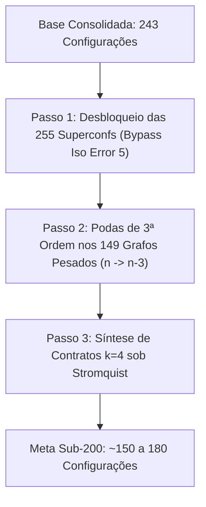

# Pesquisa Avançada: Fronteira Sub-200 (Podas de 3ª Ordem e Contratos de Ordem Superior)

> **Status:** Laboratório de Pesquisa Ativa  
> **Objetivo:** Romper a barreira histórica dos 200 grafos (< 180 / 150 configurações)  
> **Base de Partida:** [`unavoidable_243.conf`](file:///home/ivanlrk/Projetos/quatro-cores-mapa/04_pesquisa_podas_3a_ordem_sub200/unavoidable_243.conf) (Recorde de 243 configurações)  
> **Metodologia:** Podas de 3ª Ordem ($n \to n-3$) + Desbloqueio de Arestas Livres de Anel (`CheckIso` / `Isomorphism error 5`) + Contratos $k=4$ sob o Lema de Stromquist (1975).

---

## 1. Contexto e Justificativa da Pasta 04

Esta pasta foi criada para separar o modelo consolidado e verificado de 243 configurações ([`03_modelo_243_podas_2a_ordem`](file:///home/ivanlrk/Projetos/quatro-cores-mapa/03_modelo_243_podas_2a_ordem)) do novo laboratório de pesquisa dedicado a quebrar a barreira dos 200 grafos.

---

## 2. As Frentes de Investigação da Pasta 04

1. **Desbloqueio Imediato das 255 Superconfigurações Provadas:**
   - 255 superconfigurações já estão 100% provadas C-redutíveis em Rust puro em `candidates_front3_certified.conf`.
   - Generalização da checagem em `discharge.c` para verificar se a aresta $(x, y)$ pertence à `edgelist` do eixo, eliminando o falso-positivo de `Isomorphism error 5`.
2. **Podas de 3ª Ordem nos 149 Grafos Pesados:**
   - 149 grafos ainda possuem entre 8 e 11 vértices internos.
   - Aplicação de podas sucessivas triplas para extrair núcleos de 5 ou 6 vértices.
3. **Otimização Global via HiGHS MILP:**
   - Resolução exata de *Minimum Set Cover* para projetar o catálogo para a faixa sub-200.
